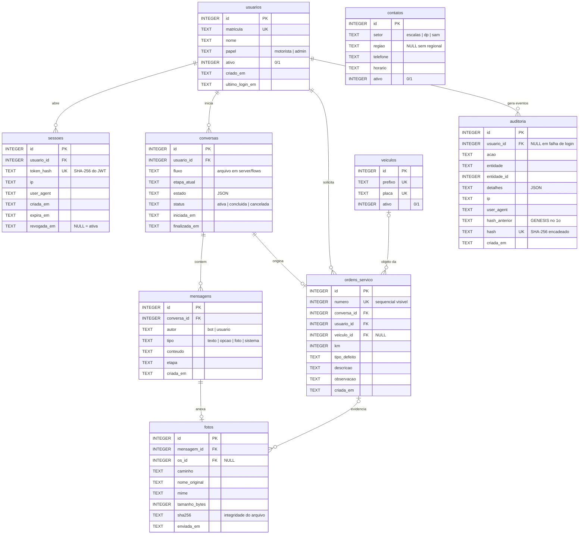

# Modelo de Dados — Portal do Motorista (Grupo GBS)

Banco: **SQLite** (arquivo `dados/portal.sqlite`), esquema portável para PostgreSQL.
DDL completo em [`server/schema.sql`](../server/schema.sql). Versão PlantUML em [`der.puml`](der.puml).

## Diagrama (Mermaid)

## Tabelas

| Tabela | Papel | Observações |
|---|---|---|
| `usuarios` | Identidade local dos usuários | Provisionado no 1º login validado no endpoint externo; senha **não** é armazenada aqui |
| `sessoes` | Sessões JWT emitidas | Guarda o SHA-256 do token (nunca o token); permite revogação no logout |
| `veiculos` | Frota | Valida prefixo/placa na abertura de OS |
| `contatos` | Telefones exibidos no fluxo Contatos | Setores: `escalas` (com regional), `dp`, `sam` |
| `conversas` | Uma linha por fluxo iniciado no chat | `estado` acumula as respostas em JSON; `fluxo` referencia o arquivo `server/flows/<Nome>.js` |
| `mensagens` | **Histórico integral do chat** | Append-only (triggers bloqueiam UPDATE/DELETE); toda bolha, do bot ou do usuário, vira uma linha |
| `fotos` | Fotos anexadas | Arquivo em disco + `sha256` para prova de integridade; vincula à mensagem e, quando houver, à OS |
| `ordens_servico` | OS geradas pelo fluxo Abrir OS | `numero` sequencial visível ao motorista |
| `auditoria` | **Trilha de auditoria** | Append-only com hash encadeado (cada linha inclui o hash da anterior — estilo blockchain); adulteração quebra a cadeia, verificável em `GET /api/admin/auditoria/verificar` |

## Ações registradas na auditoria

`LOGIN_SUCESSO` · `LOGIN_FALHA` · `LOGOUT` · `CONVERSA_INICIADA` · `ETAPA_AVANCOU` · `ETAPA_VOLTOU` · `ENTRADA_REJEITADA` · `CONVERSA_CONCLUIDA` · `CONVERSA_CANCELADA` · `FOTO_ENVIADA` · `OS_CRIADA` · `PANE_ENCAMINHADA_SAM`

Cada registro carrega: usuário, ação, entidade afetada, detalhes em JSON, IP, user-agent, timestamp e o hash encadeado.

## Relacionamentos (resumo)

- `usuarios 1—N sessoes` · `usuarios 1—N conversas` · `usuarios 1—N ordens_servico` · `usuarios 1—N auditoria`
- `conversas 1—N mensagens` (histórico) · `conversas 1—0..1 ordens_servico`
- `mensagens 1—0..1 fotos` · `ordens_servico 0..1—N fotos`
- `veiculos 0..1—N ordens_servico`
- Itens de menu (fluxos) **não são tabela**: são arquivos versionados em `server/flows/`, referenciados por `conversas.fluxo`.
